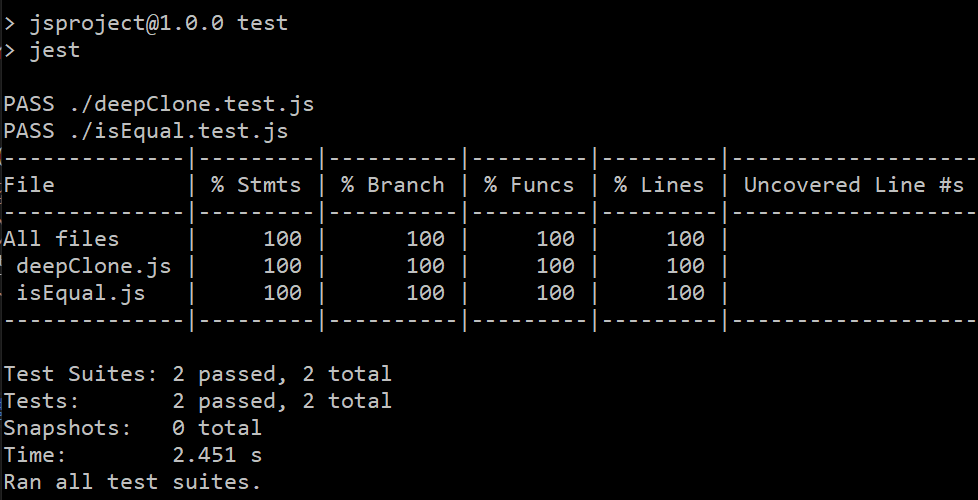

# 1. deepClone

## (1) 객체 필터링 at line 2 ~ 3

```
  if (!(data && (data.constructor === Array || data.constructor === Object)))
    return data;
```

- `constructor` 프로퍼티로 데이터 타입을 알아내고 이를 이용해 클론 되지 않을 데이터인 원시값, 함수와 그밖에 객체들을 필터링 했습니다.

## (2) 반환할 객체 초기화 at line 4

```
const result = data.constructor === Array ? [] : {};
```

- `data.constructor === Array`를 통해 input_data의 타입을 알아내 깊은 복사를 수행한 데이터를 저장할 객체를 초기화 했습니다.

## (3) 깊은 복사 at line 5 ~ 7

```
  Object.keys(data).forEach(key => {
    result[key] = deepClone(data[key]);
  });
```

- `Object.keys` 메서드를 통해 깊은 복사(deepClone)를 수행할 프로퍼티를 찾았습니다.
- `Array.prototype.forEach`를 통해 key를 순회하면서 재귀적으로 deepClone 반환값을 `result[key] = deepClone(data[key])`의 형태로 동적 할당 했습니다.

# 2. isEqual

## (1) 인수 미전달 에러 반환 at line 2 ~ 5

```
  if (arguments.length < 2)
    throw new Error(
      `isEqual requires at least 2 argument, but only ${arguments.length} were passed`
    );
```

- `템플릿 리터럴`과 `new Error()`를 이용해 에러 객체를 생성한 후, 인수가 2개 미만으로 들어온 경우, 에러를 반환했습니다.

## (2) 객체 필터링 at line 6 ~ 10

```
  if (
    data1 &&
    data2 &&
    (data1.constructor === Object || data1.constructor === Array)
  )
```

- constructor 프로퍼티로 데이터 타입을 알아내고 이를 이용해 깊은 비교를 수행할 `Array|Object` 객체를 필터링 했습니다.

## (3) 인수 유효성 검사 at line 11, 12

```
    if (data1.constructor !== data2.constructor) return false;
    if (Object.keys(data1).length !== Object.keys(data2).length) return false;
```

- 2개의 인수가 같은 타입이 아니거나 프로퍼티의 개수가 다르면 `false` 값을 반환해, 깊은 비교 수행 전 유효성을 검사했습니다.

## (4) 깊은 비교 at line 13 ~ 18

```
    for (const key of Object.keys(data1)) {
      if (Object.prototype.hasOwnProperty.call(data2, key)) {
        if (!isEqual(data1[key], data2[key])) return false;
      } else return false;
    }
    return true;
```

- `for (const key of Object.keys(data1)) { }`

  - 순회 도중 `break|continue|return`을 사용할 수 없는 `Array.prototype.forEach` 메서드 대신에 순회 도중 즉시 `함수 return`이 가능한 `for 문`을 이용해 데이터를 순회 했습니다.
  - 대상 객체의 프로퍼티만 순회하기 위해 `for...in`이 아닌 `for...of Object.keys` 형태의 반복문을 사용했습니다.

- `if (Object.prototype.hasOwnProperty.call(data2, key))`문을 이용해 data1의 프로퍼티가 data2의 대상 객체의 프로퍼티로 존재하는지 검사하고 그렇지 않다면 `false`를 반환했습니다.
- `if (!isEqual(data1[key], data2[key])) return false;`문을 이용해 재귀적으로 깊은 비교를 수행해 내부 데이터의 isEqual 값을 반환할 수 있도록 했습니다.
- `return true;` (1) - 빈 객체(`Array|Object`)이고 데이터 타입이 같은 경우 (2) - 내부의 모든 데이터 까지 값이 일치하는 경우 `true`를 반환합니다.

## (5) 원시값, 함수, 타 객체 비교 at line 20

```
  return Object.is(data1, data2);
```

- (1) 에서 필터링 되지 않은 데이터 (`원시값` | `함수` | `(함수,Array,Object)가 아닌 객체들`)들에 대해선 `===` 보다 정확한 비교(`eg. NaN, +0vs-0`)가 가능한 `Object.is` 메서드를 통해 값을 비교했습니다.

# 3. 결과


